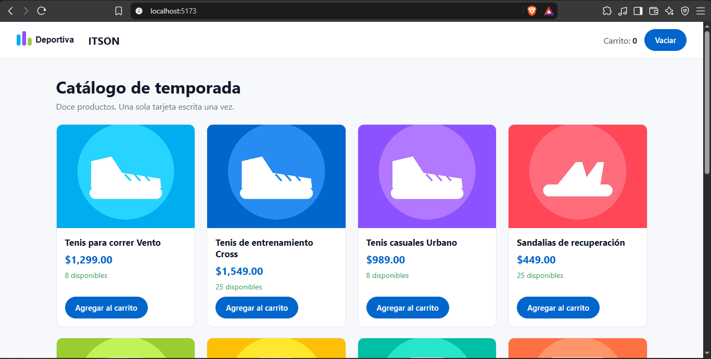
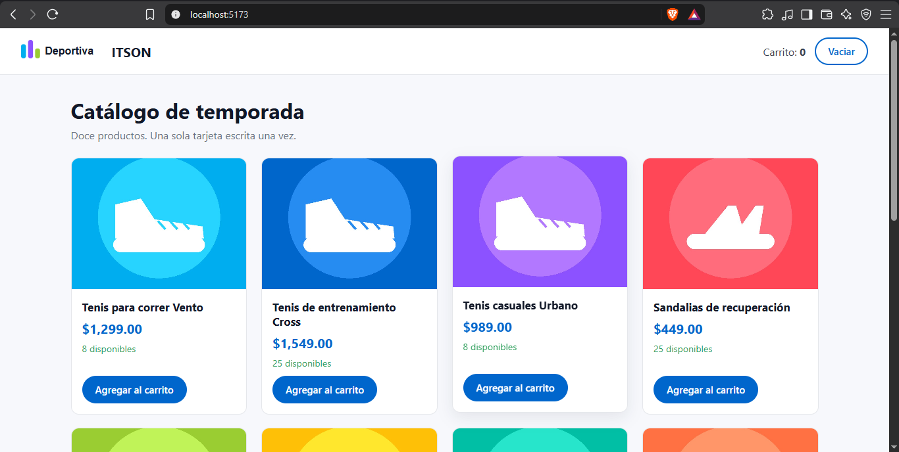
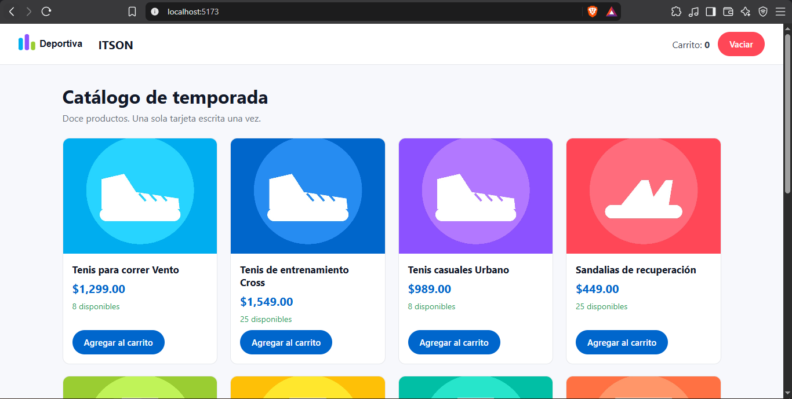
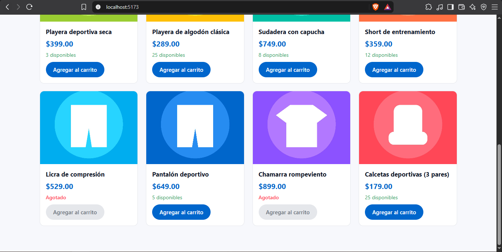
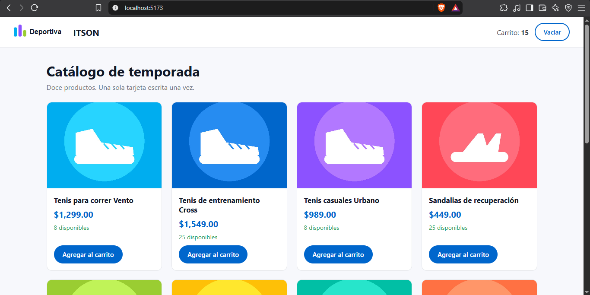

## Práctica 11.

**¿Por qué el nombre de una etiqueta propia debe llevar guion?**
Porque las etiquetas que no llevan guion son las que ya trae HTML, como `button` o `table`, entonces si  pusiera solo `boton` a mi componente podria chocar con alguna que se agregue despues. 
Con el guion el navegador tiene que saber que es una etiqueta propia.

## Evidencias

Botón primario:

Botón secundario:

Botón peligro:

Catálogo con las tarjetas agotadas:

Contador después de agregar:

