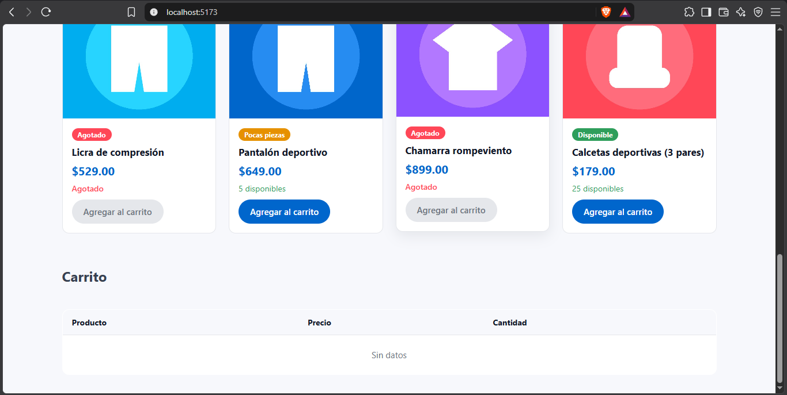
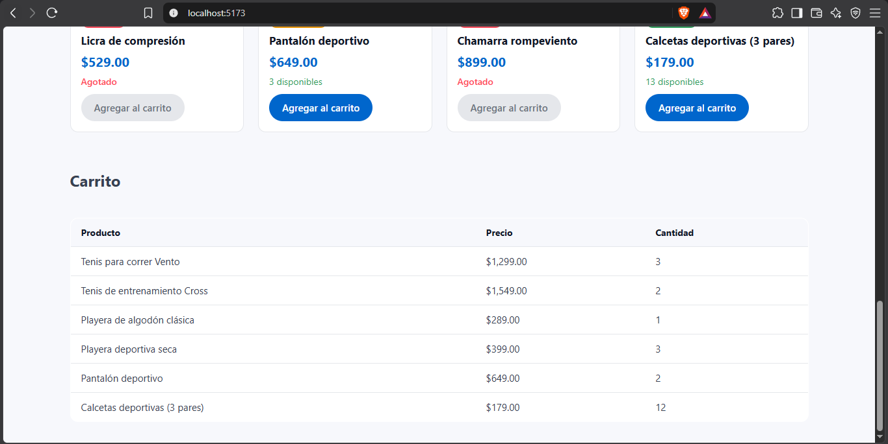
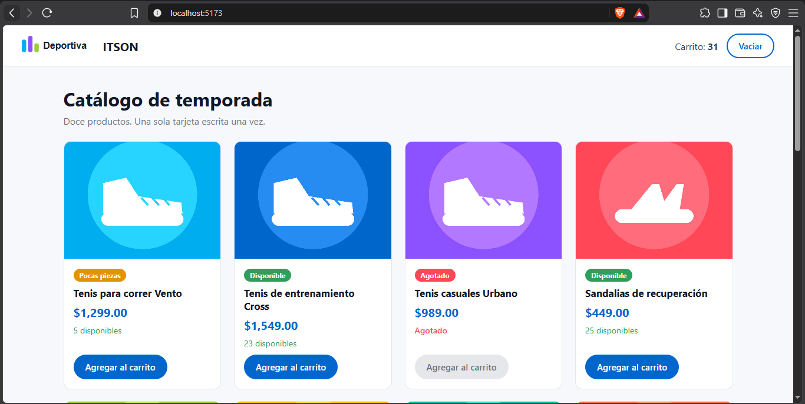

## Asignacion 03.

**¿Por qué esta tabla se puede llamar «genérica»? ¿Qué tendría que cambiar para mostrar alumnos en lugar de productos?**
Porque la tabla no sabe qué datos muestra, solo recibe las columnas y las filas, y para cada fila busca el valor con la clave de cada columna, entonces sirve igual para productos que para cualquier cosa. 
Para mostrar alumnos no tendria que cambiar nada de `tabla-generica.ts`, solo lo que le mando desde `main.ts` como nombre y matricula.

**Describan el contrato de su componente en tres partes: qué recibe, qué avisa y qué guarda adentro.**
Mi componente es `insignia-estado`. Recibe el atributo `estado`, que puede ser `disponible`, `pocas-piezas` o `agotado`, y lo observa con `observedAttributes` para volver a pintarse cuando cambia. No avisa nada hacia afuera porque no emite eventos, ya que solo muestra el estado. Adentro guarda el texto y el color de cada estado, junto con su CSS dentro del árbol de sombra, entonces nadie de afuera los puede modificar.

## Evidencias Tarea.

Tabla vacía:

Tabla con productos en el carrito:

Insignia en sus distintos estados:

